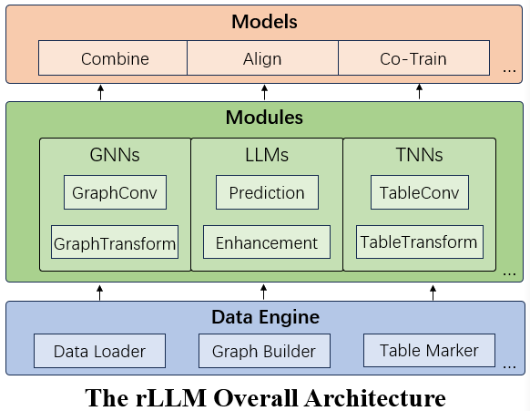

# rLLM is a easy-to-use Pytorch Lib for RTL Learning

**rLLM** (relationLLM) is an easy-to-use Pytorch library for Relational Table Learning (RTL) with LLMs, by performing two key functions:

1. Breaks down state-of-the-art GNNs, LLMs, and TNNs as standardized modules.
2. Facilitates novel model building in a "combine, align, and co-train" way using these modules.



## How to Try:

Let's run an RTL-type method BRIDGE as an example:
```shell
# cd ./examples
# set parameters if necessary

python bridge/bridge_tml1m.py
python bridge/bridge_tlf2k.py
python bridge/bridge_tacm12k.py
```

## Highlight Features:
- **LLM-friendly**: Modular interface designed for LLM-oriented applications, integrating smoothly with LangChain and Hugging Face transformers.
- **One-Fit-All Potential**: Processes various graphs (like Social/Citation/E-commerce Networks) by treating them as multiple tables linked by foreigner keys.
- **Novel Datasets**: Introduces three new relational table datasets useful for RTL model design. Includes the standard classification task, with examples.
- **Community Support**: Maintained by students and teachers from Shanghai Jiao Tong University and Tsinghua University. Supports the SJTU undergraduate course "Content - Understanding (NIS4301)" and the graduate course "Social Network Analysis (NIS8023)".

## Todo List:
- Code structure optimization
- Large-scale RTL training
- LLM prompt optimization
- Support for more TNNs

## Citation:
If you find rLLM useful, please cite the following paper:
```
@article{rllm2024,
      title={rLLM: Relational Table Learning with LLMs}, 
      author={Weichen Li and Xiaotong Huang and Jianwu Zheng and Zheng Wang and Chaokun Wang and Li Pan and Jianhua Li},
      year={2024},
      eprint={2407.20157},
      archivePrefix={arXiv},
      primaryClass={cs.AI},
      url={https://arxiv.org/abs/2407.20157}, 
}
```